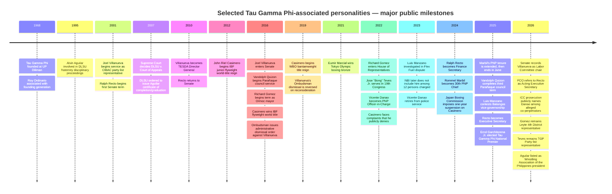

# Notable Tau Gamma Phi Personalities in the Philippines: Leadership, Public Office, Sports, and Entertainment

## Executive summary

Tau Gamma Phi, commonly known as the Triskelions’ Grand Fraternity, traces its founding to the University of the Philippines Diliman in 1968. The public record shows that its best-documented high-profile members have occupied positions across national politics, local government, the Philippine National Police, elite sport, professional basketball and boxing, mixed martial arts, television, film, and music. The evidence is strongest where membership is self-declared, stated by a fraternity-controlled account, or established in an original government or court document; it is appreciably weaker where affiliation appears only in news coverage or commemorative social-media posts. citeturn4search0turn26view0

The clearest current national-fraternity leadership record located for this review is **Police Lt. Col. Errol Garchitorena Jr.**, whom the Tau Gamma Phi National Council announced as the elected **National Premier for the 2025–2027 term** after the November 2025 election. At the historical end, an official House-related public post identifies **Roy Ordinario** as a Tau Gamma Phi “Founding Father.” citeturn15search1turn15search7turn12search19

In national government, the strongest documented examples include **Sen. Joel Villanueva**, **Ralph G. Recto**, **Leyte Rep. Richard Gomez**, and **TGP Party-list Rep. Jose “Bong” Teves Jr.**; senior police figures include former PNP chiefs or officers-in-charge **Rommel Francisco Marbil** and **Vicente Dupa Danao Jr.** Local-government representation includes former Parañaque councilor **Vandolph Quizon**. Their careers demonstrate that Tau Gamma Phi-associated personalities are not concentrated in one political camp or one type of institution. citeturn20search2turn9search6turn19search1turn19search2turn14search0turn14search1turn14search2

In sport, the most consequential names located are **Olympic bronze medalist Eumir Marcial**, **PBA and Philippine national-team center Raymond Almazan**, **three-division boxing champion John Riel Casimero**, and combat-sports organizer **Arthur Alvin Aguilar**, now listed by United World Wrestling as president of the Wrestling Association of the Philippines and by the Philippine Olympic Committee as a board member. citeturn10search0turn10search1turn11search1turn18search29turn18search5

The record also contains important controversies that require careful legal distinctions. Villanueva's 2016 Ombudsman administrative dismissal order was reversed on reconsideration in 2019, a development that became a major public issue in 2025; Danao has been **named by ICC prosecutors as an alleged co-perpetrator** in filings in the Duterte crimes-against-humanity case, which is an allegation rather than a conviction; Casimero faced 2022 complaints involving a minor that he denied and a separate one-year Japan Boxing Commission suspension for missing weight; Aguilar appears in a Supreme Court decision arising from a 1995 DLSU fraternity-violence disciplinary case; and Luis Manzano was investigated in the Flex Fuel investment controversy but was **not among the 12 persons charged by the NBI** in 2023. citeturn25search1turn25search3turn22search2turn22search14turn18search3turn25search4turn26view0turn24search5

iturn27image0

*Portrait above: Sen. Joel Villanueva's 2022 official portrait, released by his office and reproduced on Wikimedia Commons. Villanueva has himself publicly referred to Tau Gamma Phi as his “beloved” fraternity. citeturn26view2*

## Scope, assumptions, and verification method

**Geographic scope:** Philippines. **Timeframe:** historical record through **October 2, 2026**. The report excludes private addresses, family contact information, nonpublic disciplinary information, medical details, and similar privacy-intrusive material. “Full name” means the fullest name reliably established in the cited public record; where the underlying sources use only an official or professional name, additional legal-name components are treated as **unspecified** rather than inferred.

Tau Gamma Phi's public-facing record is unusually fragmented. I did **not** locate a single public, auditable national membership register against which every claimed member could be checked. Accordingly, this report distinguishes several kinds of evidence: self-identification by the person; an announcement by the Tau Gamma Phi National Council or another fraternity-controlled page; a government or court record expressly identifying membership; and independent reporting by a reputable news organization. A fraternity social-media post is useful as direct evidence of how the organization publicly presents someone, but it is not equivalent to an independently audited membership roll.

One unusually strong example is **Arthur Alvin Aguilar**: the Supreme Court itself stated in *De La Salle University v. Court of Appeals* that Aguilar and three other respondents were members of Tau Gamma Phi. The decision records the 1995 fraternity conflict, the DLSU discipline proceedings, CHED's subsequent action, and the Supreme Court's eventual disposition. citeturn26view0 Another strong case is Villanueva, who personally posted a 2018 anniversary message referring to “my beloved Tau Gamma Phi.” citeturn26view2

A critical nomenclature point concerns **TGP Party-list**. The House officially lists Jose “Bong” Teves Jr. as representative of “TGP,” but that party-list designation by itself should **not** be treated as proof of Tau Gamma Phi fraternity membership. His fraternity association is included here because separate fraternity-oriented public material identifies Teves among Tau Gamma Phi/Tau Gamma Sigma members; the House party-list label is reported separately as his political affiliation. citeturn19search2turn3search10

For controversies, “none identified” means **no material, well-sourced public legal or disciplinary issue was located in the source set reviewed**. It does not certify that a person has never faced a complaint or controversy. Allegations, administrative findings, criminal charges, suspensions, acquittals/reversals, and convictions are treated as legally different categories.

## Comparative table of notable figures

| Name | Chapter / affiliation | Tau Gamma Phi role | Public / professional role | Notable achievements | Controversies / legal issues | Primary / best direct source |
|---|---|---|---|---|---|---|
| **Roy Ordinario** | UP Diliman founding circle; more specific chapter designation unspecified | Publicly identified as **Founding Father** | Public/professional career details unspecified in the strongest sources reviewed | Associated with the fraternity's founding generation; TGP was founded at UP Diliman in 1968. citeturn4search0turn12search19 | No material public legal issue identified in this review | House-related public post identifying “Tau Gamma Phi Founding Father Roy Ordinario.” citeturn12search19 |
| **Errol Garchitorena Jr.** | Bicol Regional Council; exact school/community chapter unspecified | **National Premier, National Executive Council, 2025–2027** | Police lieutenant colonel; PNP | Elected to the fraternity's top publicly documented national executive post in November 2025. citeturn15search1turn15search7 | No material public legal issue identified in reviewed high-quality sources | Tau Gamma Phi National Council election announcement. citeturn15search1turn15search10 |
| **Joel Villanueva** | TGP fraternity material identifies **UST High School Chapter, Batch 1994** | Member; no national fraternity office verified | CIBAC representative, 2001–2010; TESDA director general, 2010–2015; senator, 2016–present | National legislator and former technical-vocational education chief; in 2026 the Senate record identifies him as chair of Labor, Employment and Human Resources Development. citeturn20search2 | Ombudsman ordered his dismissal in 2016 over the PDAF controversy; a 2019 reconsideration order reversed that action and became the subject of renewed scrutiny in 2025. citeturn25search1turn25search3turn25search13 | Villanueva's own Tau Gamma Phi anniversary message. citeturn26view2 |
| **Ralph G. Recto** | Exact TGP chapter unspecified; membership reported by Philippine media | Member; internal office unspecified | Batangas representative, 1992–2001 and 2022–2024; senator, 2001–2007 and 2010–2022; NEDA chief, 2008–2009; finance secretary, 2024–2025; Executive Secretary from Nov. 2025, described by PCO as Acting Executive Secretary in 2026 | One of the longest-serving economic-policy figures in post-EDSA national government; moved from Congress to DOF and then the Office of the Executive Secretary. citeturn9search14turn9search6 | In 2026, a criminal complaint relating to the PhilHealth fund transfer during his DOF tenure was reported; the Office of the Executive Secretary said it had not yet received a copy and maintained he acted pursuant to the 2024 GAA. No finding of criminal liability is established by that source. citeturn19search8 | PCO records for current office; SunStar separately reported Tau Gamma Phi membership. citeturn9search6turn2search13 |
| **Richard Frank Gomez** | Exact TGP chapter unspecified | Member; internal role unspecified | Ormoc mayor, 2016–2022; Leyte 4th District representative, 2022–present; Philippine Olympic Committee second vice-president | Successful transition from entertainment/local government to Congress; House records in the 20th Congress also document resolutions commending his international and regional shooting accomplishments. citeturn19search1turn19search21turn18search5 | No material personal legal issue identified in the reviewed source set | Official House member profile; membership separately reported together with Recto. citeturn19search1turn3search2 |
| **Jose “Bong” J. Teves Jr.** | Exact fraternity chapter unspecified; **TGP Party-list** is his separate political affiliation | Publicly described among Tau Gamma Phi/Tau Gamma Sigma members; internal fraternity office unspecified | TGP Party-list representative, 19th and 20th Congresses; former deputy majority leader; elected House member of the Commission on Appointments in the 20th Congress | National legislative leadership and Commission on Appointments membership. citeturn19search2turn19search20 | No material personal legal issue identified in reviewed sources | Official House profile, plus fraternity-oriented material independently asserting fraternity membership. citeturn19search2turn3search10 |
| **Rommel Francisco D. Marbil** | Fraternity material identifies **Ermitaño Chapter, San Juan** | Member; internal office unspecified | **30th Chief, Philippine National Police**, Apr. 1, 2024–June 2, 2025 | Led the PNP nationally; his service was extended four months in 2025, and PNP reporting highlighted a more civilian-centered policing approach during his tenure. citeturn14search24turn14search20turn14search0 | No material personal criminal case identified in reviewed sources; the presidential extension of his tenure was a notable institutional decision rather than a finding of wrongdoing | PIA/PCO/PNA for PNP tenure; fraternity post publicly calls him “Brother” Marbil. citeturn14search24turn12search4turn12search25 |
| **Vicente Dupa Danao Jr.** | Fraternity material identifies **St. Mary's College/Bayombong, Nueva Vizcaya** affiliation | Member; internal fraternity office unspecified | PNP officer-in-charge, May 8–Aug. 1, 2022; former NCRPO, MPD and regional police chief; retired 2023 | Reached the operational headship of the PNP and held multiple regional/national police commands. citeturn14search1turn14search9 | ICC prosecutors have named Danao among alleged co-perpetrators in filings in the Rodrigo Duterte crimes-against-humanity case. This is a prosecution allegation, **not a conviction or final finding against Danao**. citeturn22search2turn22search14turn22search10 | PNA for PNP role; fraternity sources for chapter affiliation. citeturn14search1turn12search9 |
| **Vandolph Lacsamana Quizon** | Chapter unspecified | Member; internal office unspecified | Actor; Parañaque 1st District councilor, 2016–2025 | Combined a long entertainment career with three consecutive local-government terms. His 2015 filing and subsequent reelection activity were covered by major national outlets. citeturn14search22turn14search10turn14search26 | No material public legal issue identified in reviewed sources | Tau Gamma Phi fraternity post expressly calls him a Triskelion and Parañaque councilor. citeturn12search3 |
| **Eumir Felix Marcial** | Public fraternity material associates him with **Tau Gamma Phi Zamboanga City Council**; precise chapter unspecified | Member; internal office unspecified | Olympic/professional boxer | **Tokyo 2020 Olympic bronze medalist**; Olympics reporting notes the medal was the Philippines' first Olympic boxing medal since 1996. citeturn10search0turn10search3 | No material public legal issue identified in reviewed sources | Olympics.com athlete record; TGP Zamboanga fraternity post for affiliation. citeturn10search0turn7search0 |
| **Raymond Almazan** | **Orion Central Chapter** | Fraternity post describes him as former **“MWW”**; the abbreviation is not expanded in the cited public record | PBA center; Philippine national-team player | Represented the Philippines at the **2019 FIBA Basketball World Cup** and other FIBA competition; listed as an active PBA center in 2026. citeturn10search1turn10search2turn10search4 | No material public legal issue identified | FIBA/PBA records plus fraternity chapter post. citeturn10search1turn7search1 |
| **John Riel Reponte Casimero** | Chapter unspecified | Member; internal fraternity office unspecified | Professional boxer | **Three-division world champion**: IBF junior-flyweight, IBF flyweight and WBO bantamweight. citeturn11search1 | 2022 acts-of-lasciviousness/RA 7610 complaints involving a minor were reported; Casimero denied the allegations. Separately, the Japan Boxing Commission imposed a one-year suspension in 2024 for failure to make the 122-lb limit. citeturn18search3turn18search7turn25search4turn25search18 | Fraternity posts identify him as a Triskelion; GMA and boxing records document career and disciplinary matters. citeturn7search6turn18search3 |
| **Arthur Alvin A. Aguilar** | De La Salle/De La Salle-Zobel-associated TGP; DLSU fraternity membership established by Supreme Court record | Public self-account says he became **Grand Triskelion** and later held an **“MDG”** role; expansion of MDG not sufficiently verified | Founder of URCC/DEFTAC; president, Wrestling Association of the Philippines; Philippine Olympic Committee board member | Major institution-builder in Philippine MMA/grappling; currently heads the national wrestling federation recognized by UWW. citeturn18search29turn18search5 | A 1995 DLSU fraternity conflict led to disciplinary proceedings. CHED ultimately directed Aguilar's reinstatement, and the Supreme Court in 2007 ordered DLSU to issue his completion/graduation certificate while affirming CHED's resolution. citeturn26view0 | **Supreme Court decision expressly establishing Tau Gamma Phi membership**; UWW for current sports role. citeturn26view0turn18search29 |
| **Juan Miguel “JM” Gob de Guzman** | **UP Diliman Chapter** | Former **Deputy Grand Triskelion** | Actor, singer; former competitive wrestler | One of the better-documented entertainment figures to have held an actual chapter office rather than simply membership. Fraternity sources identify his UP Diliman deputy leadership role. citeturn8search0turn8search4 | No material public legal issue included in this review; private health matters are outside scope | Tau Gamma Phi public material identifying him as former Deputy Grand Triskelion. citeturn8search0 |
| **Luis Philippe Santos Manzano** | **DLSU-associated chapter** according to fraternity material | Member; internal office unspecified | Television host/actor; unsuccessful Batangas vice-gubernatorial candidate in 2025 | Long-running Philippine game/talent-show host; also a recognized entertainment personality and 2025 provincial candidate. citeturn24search12turn8search20 | Investors included him in 2023 Flex Fuel complaints, and the NBI subpoenaed him; the NBI later **did not include Manzano among the 12 persons charged with syndicated estafa**. citeturn24search3turn24search5 | Tau Gamma Phi material for DLSU association; GMA for Flex Fuel disposition. citeturn8search5turn24search5 |
| **Nathan Peter Hachero Azarcon** | **UST Chapter** | Member; internal fraternity office unspecified | Bassist, songwriter; Rivermaya/Bamboo musician | Prominent figure in Philippine rock through his work with Rivermaya and Bamboo; TGP fraternity material specifically identifies him as a UST Chapter member and Rivermaya bassist. citeturn8search7turn8search10 | No material public legal issue identified in reviewed sources | Tau Gamma Phi fraternity post identifying Azarcon and UST chapter. citeturn8search7 |

## Individual profiles

**Roy Ordinario.** Ordinario belongs in this study primarily because of his historical significance rather than public office or celebrity. A House-related public post explicitly describes him as a **Tau Gamma Phi Founding Father**, connecting him to the fraternity's originating generation at UP Diliman. citeturn12search19turn4search0 The reviewed high-quality sources do not establish a fuller legal name, a later formal national office, or a sufficiently documented public professional career, so those fields are best treated as **unspecified**. No material legal controversy involving Ordinario was located in the source set reviewed.

**Errol Garchitorena Jr.** The Tau Gamma Phi National Council announced Garchitorena as the newly elected **National Premier** in November 2025, with subsequent fraternity material describing the National Executive Council as serving the **2025–2027** period. citeturn15search1turn15search7 Fraternity material associates him with the **Bicol Regional Council** and gives his professional rank as police lieutenant colonel, although a detailed official PNP biography was not located. citeturn15search10turn15search15 He is therefore the strongest contemporary example in this review of a member whose significance derives from an actual national Tau Gamma Phi office, rather than celebrity membership. No major public legal controversy was found in the reviewed authoritative sources.

**Joel Villanueva.** Villanueva's membership is unusually well supported because he personally published a golden-anniversary message to his “beloved Tau Gamma Phi”; fraternity material further places him in the UST High School Chapter, Batch 1994. citeturn26view2turn2search7 His public career spans the CIBAC party-list in the House, the directorship-general of TESDA, and the Senate from 2016 onward; a September 2026 Senate journal identifies him as chair of the Committee on Labor, Employment and Human Resources Development. citeturn20search2 His most serious controversy arose from the PDAF matter: the Ombudsman issued a 2016 administrative dismissal order, but then-Ombudsman Samuel Martires reversed that result on reconsideration in 2019; disclosure and handling of the reversal generated renewed political and legal scrutiny in 2025. citeturn25search1turn25search3turn25search13 The correct characterization is therefore not that Villanueva currently stands under the original 2016 dismissal order, but that the order was subsequently reversed and the manner and legal effect of that reversal itself became contested.

**Ralph G. Recto.** Philippine reporting has identified Recto as a Tau Gamma Phi member, although the strongest independent sources reviewed do not consistently identify a specific chapter. citeturn2search13turn3search2 His institutional reach is exceptional: he has served in the House and Senate, headed NEDA, became finance secretary in January 2024 and moved to the Office of the Executive Secretary in November 2025; official PCO material in 2026 refers to him as Acting Executive Secretary. citeturn9search14turn9search6turn9search25 A current controversy concerns the transfer of PhilHealth funds during his DOF tenure: a 2026 PCO briefing acknowledged a criminal complaint and relayed Recto's position that he had acted in good faith pursuant to the 2024 General Appropriations Act. citeturn19search8 That complaint should not be described as a conviction or adjudication of criminal liability.

**Richard Frank Gomez.** Gomez is identified in reporting alongside Recto as a Tau Gamma Phi member, while his official House page confirms that he represents Leyte's 4th District in the 20th Congress. citeturn3search2turn19search1 His public trajectory is distinctive because it combines a major entertainment career, two terms as Ormoc mayor, national legislative office, and formal sports-administration responsibility as second vice-president of the Philippine Olympic Committee. citeturn18search5 House records in 2025–2026 additionally document resolutions commending Gomez's accomplishments in international and regional shooting competitions, giving him a genuine athlete/sports dimension beyond celebrity status. citeturn19search4turn19search21 No comparably significant personal criminal or administrative case emerged from the source set reviewed.

**Jose “Bong” J. Teves Jr.** The House officially lists Teves as a **TGP Party-list representative**, and the 20th Congress elected him among the House members of the Commission on Appointments. citeturn19search2turn19search20 Separate fraternity-oriented material, rather than the party-list name itself, is what supports his inclusion as a Tau Gamma Phi-associated personality. citeturn3search10turn12search19 This distinction matters because political affiliation with a party-list carrying the initials “TGP” is analytically different from personal fraternity membership. Teves has also held House leadership responsibilities, including deputy-majority-leader status in the preceding Congress; no material personal legal case was located in the reviewed sources.

**Rommel Francisco D. Marbil.** Fraternity material identifies former PNP chief Rommel Marbil as a Tau Gamma Phi brother and associates him with the **Ermitaño Chapter in San Juan**. citeturn12search4turn12search25 Government sources establish that he became the **30th Chief of the Philippine National Police effective April 1, 2024**, and that President Ferdinand Marcos Jr. later extended his service by four months in 2025. citeturn14search24turn14search20 PNA's coverage of his retirement highlights reforms and a policing philosophy described as more civilian-centered; he left the post in June 2025. citeturn14search0 No material personal criminal proceeding was identified in the sources reviewed.

**Vicente Dupa Danao Jr.** Fraternity-run sources connect Danao to the **St. Mary's College/Bayombong, Nueva Vizcaya** TGP community. citeturn12search9turn12search30 In public service, he rose through major commands including the Manila Police District, Calabarzon and NCR police offices, and became officer-in-charge of the PNP in May 2022. citeturn14search1turn14search9 His profile now carries an exceptionally serious legal-context qualification: in 2026, ICC prosecutors identified Danao among alleged co-perpetrators in their presentation of the Duterte crimes-against-humanity case. citeturn22search2turn22search14turn22search10 This report deliberately uses **“alleged”** because the cited material documents a prosecution theory and filing, not a final conviction of Danao.

**Vandolph Lacsamana Quizon.** A Tau Gamma Phi fraternity post describes Quizon as a “Triskelion Actor/Councilor” from Parañaque, making his fraternity association explicit even though a precise chapter was not provided. citeturn12search3 GMA reported his 2015 candidacy for city council, and later election reporting supports a local-government career running from 2016 through the end of his third term in 2025. citeturn14search22turn14search10turn14search26 His relevance is therefore as one of the clearer intersections between Philippine entertainment and elected local office among publicly identified Triskelions. No material legal controversy was found in the authoritative sources reviewed.

**Eumir Felix Marcial.** Public Tau Gamma Phi material from Zamboanga identifies Olympic boxer Eumir Marcial as a fraternity brother associated with the **Zamboanga City Council** network. citeturn7search0 His sporting significance is much more independently documented: Olympics.com records his **Tokyo Olympic bronze medal**, while Olympic reporting describes it as the Philippines' first boxing medal at the Games since 1996. citeturn10search0turn10search3 He later continued through the Asian Games/Olympic qualification pathway and professional boxing. citeturn10search6 No significant public legal issue relevant to this report was located.

*Eumir Marcial in a web image published by Globe in its feature on Filipino Olympic medalists; his Olympic medal record is independently documented by Olympics.com. citeturn10search0turn10search3*

**Raymond Almazan.** A fraternity post identifies PBA player Raymond Almazan with the **Orion Central Chapter** and describes him as a former “MWW”; because that abbreviation was not defined in the public source inspected, this report does not expand it speculatively. citeturn7search1turn7search9 FIBA's own records document Almazan as a Philippine national-team player at the **2019 FIBA World Cup**, while PBA material continued to list him as an active center in 2026. citeturn10search1turn10search2 He is therefore a particularly strong example of an identified chapter affiliate with a sustained elite team-sport career. No significant public legal controversy was located.

**John Riel Reponte Casimero.** Tau Gamma Phi-oriented public pages have repeatedly described Casimero as a Triskelion brother, although a chapter was not established from the strongest material available. citeturn7search6turn7search2 His sporting credentials are substantial: he has held world championships in **three divisions**, including IBF junior-flyweight and flyweight belts and the WBO bantamweight title. citeturn11search1 His record also requires two separate controversy notes: GMA reported 2022 complaints alleging acts of lasciviousness and an offense under RA 7610 involving a minor, which Casimero denied, while in 2024 the Japan Boxing Commission imposed a one-year suspension after he failed to make the contracted super-bantamweight limit. citeturn18search3turn18search7turn25search4 Neither matter should be conflated with the other, and the cited 2022 reporting does not establish a conviction.

**Arthur Alvin A. Aguilar.** Aguilar has perhaps the strongest documentary proof of fraternity membership among the non-politicians in this report: the Philippine Supreme Court expressly identified **Alvin Aguilar as a member of Tau Gamma Phi** in litigation arising from a 1995 DLSU fraternity conflict. citeturn26view0 His own later fraternity account says he entered Tau Gamma Phi while at De La Salle-Zobel and subsequently became a senior member, **Grand Triskelion**, and holder of an “MDG” position at DLSU; the exact expansion of the latter abbreviation is left unspecified because it was not independently established. citeturn7search17turn7search21 Professionally, UWW now lists Aguilar as **president of the Wrestling Association of the Philippines**, while the Philippine Olympic Committee lists him on its board. citeturn18search29turn18search5 The Supreme Court case is legally nuanced: DLSU's disciplinary board had acted against students after a violent fraternity conflict, but CHED directed Aguilar's reinstatement and the Supreme Court ultimately ordered DLSU to issue his certificate of completion/graduation. citeturn26view0

**Juan Miguel “JM” Gob de Guzman.** Fraternity material identifies actor JM de Guzman not merely as a member but as a former **Deputy Grand Triskelion of the UP Diliman Chapter**, which makes him one of the few entertainment personalities in the sample with a documented chapter leadership position. citeturn8search0turn8search4 His public career developed primarily in acting and music, alongside a background in wrestling. citeturn8search15 That combination makes his case analytically different from celebrities who appear only in anniversary greetings: the public fraternity material attributes an actual governance role to him. This report deliberately excludes discussion of personal health and rehabilitation matters because they are not necessary to answer the question and fall outside the requested non-intrusive scope.

**Luis Philippe Santos Manzano.** Tau Gamma Phi material associates television personality Luis Manzano with a **DLSU chapter/La Salle affiliation**, although no internal fraternity office was verified. citeturn8search5turn8search8 He built a long career as a television host and later entered electoral politics, contesting the Batangas vice-governorship in May 2025 and losing the race. citeturn24search12turn24search25 His most significant legal-business controversy was the Flex Fuel investment dispute: investors included him in complaints and the NBI issued a subpoena, but GMA subsequently reported that the NBI's syndicated-estafa case covered **12 other officers and did not charge Manzano**. citeturn24search3turn24search5 A rigorous account therefore should neither erase the investigation nor falsely say he was prosecuted in the NBI case.

**Nathan Peter Hachero Azarcon.** Tau Gamma Phi public material identifies musician Nathan Azarcon as a **UST Chapter** brother and explicitly describes him in connection with Rivermaya. citeturn8search7turn8search10 Azarcon's professional significance comes from his bass work and songwriting in major Philippine rock acts, especially Rivermaya and Bamboo, giving the fraternity a documented link to the country's mainstream alternative-rock era. citeturn8search3 Unlike Aguilar, De Guzman, or Garchitorena, the reviewed material does not establish that Azarcon held a chapter or national fraternity office. No material public legal controversy involving him was found in the source set reviewed.

## Analytical findings

The first important pattern is **institutional breadth rather than a single center of influence**. The sample spans the Senate, Malacañang, the House, city government, senior police command, Olympic sport, professional boxing and basketball, sports federation governance, film and television, and popular music. Current or recent examples include Villanueva in the Senate, Recto in the Office of the Executive Secretary, Gomez and Teves in the House, and Marbil and Danao in the upper ranks of the PNP. citeturn20search2turn9search6turn19search1turn19search2turn14search0turn14search1

Second, **membership should not be confused with fraternity leadership**. Of the figures examined, the strongest evidence of actual internal offices concerns Garchitorena as National Premier, Ordinario as a founding father, Aguilar as a former Grand Triskelion/other chapter officer in his own account, De Guzman as a former Deputy Grand Triskelion, and Almazan as a former “MWW” according to an Orion Central Chapter post. For most high-profile politicians, athletes and entertainers, the evidence supports membership or affiliation but **does not establish that they ever held a national executive post**. citeturn15search1turn12search19turn7search17turn8search0turn7search1

Third, the evidentiary quality varies markedly by person. **Aguilar's membership has judicial-document status**, because it appears in a Supreme Court decision; **Villanueva's is self-authenticated** by his own public statement; Garchitorena's office comes directly from the National Council; Marcial, Almazan and several entertainers are documented mainly through fraternity-controlled social accounts. citeturn26view0turn26view2turn15search1turn7search0turn7search1turn8search7 That does not necessarily make the latter claims false, but it means they carry a different evidentiary weight.

Fourth, fraternity association is **not itself evidence of responsibility for a member's controversy**. Danao's ICC-related status concerns his policing career and prosecutors' theory of the Duterte anti-drug campaign; Villanueva's PDAF matter concerns his prior congressional activity; Casimero's complaints and boxing sanction concern his personal/professional conduct; Manzano's Flex Fuel matter concerned a private business dispute; and Aguilar's case, unusually, did arise directly from an inter-fraternity conflict. citeturn22search14turn25search3turn18search3turn25search4turn24search5turn26view0 Analytical rigor requires resisting guilt-by-association in either direction.

Fifth, **legal posture matters**. The 2016 Ombudsman finding against Villanueva was later reversed; the ICC material naming Danao is prosecutorial allegation rather than a conviction; the 2022 allegations against Casimero were denied and the cited sources do not establish a conviction; Aguilar's DLSU discipline case ended with the Supreme Court ordering issuance of his certificate; and Manzano was investigated but omitted from the NBI's eventual syndicated-estafa charges. citeturn25search1turn22search2turn18search7turn26view0turn24search5 Reporting these matters merely as “cases” without their procedural outcomes would materially distort the record.

Finally, **TGP Party-list and Tau Gamma Phi must be kept conceptually separate**. The House's official label establishes Jose Teves's party-list seat, not, by itself, fraternity membership. His inclusion as a fraternity personality rests on separate public material that associates him personally with Tau Gamma Phi/Tau Gamma Sigma. citeturn19search2turn3search10 This distinction is especially important in database-building or network analysis, where acronym matching can otherwise generate circular or false membership claims.

## Milestone timeline

The timeline below emphasizes verifiable public milestones rather than initiation dates, many of which are not reliably published. Founding, officeholding, sports achievements and major legal/disciplinary events are drawn from the government, judicial, sports and reputable-news sources cited throughout the report. citeturn4search0turn26view0turn10search0turn14search24turn9search14

## Source notes and research limits

The highest-value original documents in this review are the **Supreme Court's 2007 decision in *De La Salle University v. Court of Appeals***, which directly establishes Aguilar's fraternity membership and reconstructs the 1995 disciplinary case; official **House of Representatives** profiles for Gomez and Teves; **Senate** records for Villanueva's current committee role; **Presidential Communications Office**, PIA and PNA records for Recto, Marbil and Danao; and institutional sports records from **Olympics.com, FIBA, United World Wrestling and the Philippine Olympic Committee**. citeturn26view0turn19search1turn19search2turn20search2turn9search6turn14search24turn14search1turn10search0turn10search1turn18search29turn18search5

For affiliation evidence, direct fraternity social-media material was sometimes unavoidable because chapter rosters are generally not published as durable government-style databases. Such sources were used conservatively: a post calling someone “Brother,” naming a chapter, or identifying an internal role was treated as evidence of the fraternity's own public representation of that person, while independent professional facts were cross-checked against government, sports-governing-body, court, or major-news sources wherever possible. This is why, for example, Marcial's fraternity affiliation rests on a TGP Zamboanga source while his Olympic accomplishment rests on Olympics.com, and Almazan's chapter information comes from TGP material while his national-team career is confirmed by FIBA. citeturn7search0turn10search0turn7search1turn10search1

The most important unresolved data are **exact initiation dates, complete national membership histories, and chapter affiliations for several politicians and athletes**. They are therefore marked “unspecified” rather than reconstructed from fan pages, unsourced lists, or name-matching. Similarly, no inference is made that a person's fame, political position, police rank, or appearance at a fraternity function proves that he held a formal internal office.

The controversy review is also intentionally procedural. For Villanueva, later reversal of the Ombudsman action is part of the record; for Danao, the ICC material remains an allegation in a larger prosecution; for Casimero, the reported 2022 complaint and the 2024 boxing-regulatory sanction are different proceedings; for Aguilar, the Supreme Court outcome materially qualifies the original university disciplinary action; and for Manzano, the NBI's decision not to include him in the syndicated-estafa charges is essential context. citeturn25search3turn22search14turn18search3turn25search4turn26view0turn24search5

Accordingly, the table should be read as a **verified, source-weighted sample of notable publicly documented Tau Gamma Phi personalities, not a definitive membership registry**. The evidence is strongest for Ordinario, Garchitorena, Villanueva, Aguilar and figures whose affiliation is directly asserted by the fraternity or the individual; for others, chapter or internal-office information remains expressly unspecified rather than assumed.