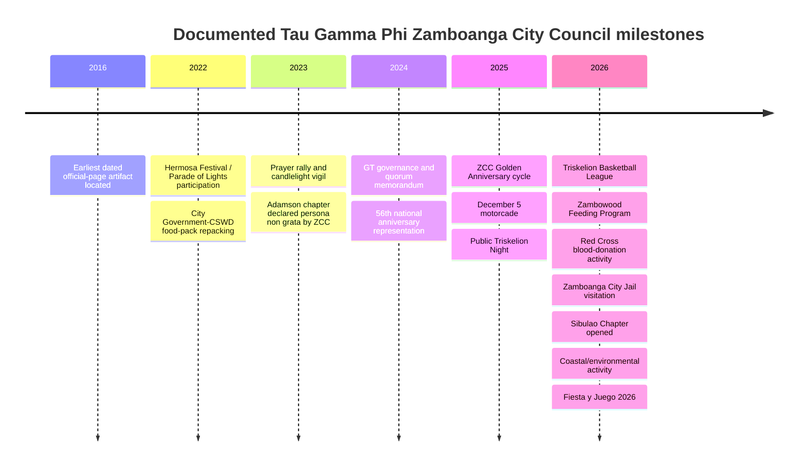

# Tau Gamma Phi Zamboanga City Council: Leadership, Chapters, Public Figures and Activities

**Research cut-off:** 2 October 2026, Asia/Manila  
**Primary source:** Tau Gamma Phi Zamboanga City Council official Facebook page, `facebook.com/TGPZCC`  
**Scope:** Publicly documented information only. “Years active” below means the period that can be demonstrated from the sources reviewed; it should **not** be read as a complete membership or term history.

## Executive summary

The strongest primary-source evidence identifies the **Tau Gamma Phi Zamboanga City Council (TGP-ZCC)** as a long-established local council whose own historical account places its formal establishment on **5 December 1975 in Baliwasan Chico**, under local founder **Bro. Alfredo Granados**. The same official-page historical material says the fraternity later established its **WMSU Mother Chapter on 8 December 1978**. The council treated 2025 as its **Golden/50th anniversary year**, which is consistent with a 1975 founding date. citeturn11search4turn36search10turn36search12turn30search3

The best-supported recent leadership sequence is:

**2022:** City Chairman **Anfernee Jay Fernandez** with Vice City Chairman **Maverick Bader Sebastian**. citeturn28search0turn29search1  
**2024:** City Chairman **Marlon G. Avenido** with Vice-Chairman/Deputy Grand Triskelion **Ferdinand D. Sotto**. citeturn26search0turn38search1  
**2026:** Avenido was still publicly described as the council's leader immediately before the 27 September 2026 Fiesta y Juego, while **Belmar F. Rojas / Belmar Rojas Fabian** was publicly identified as **City Vice Chairman** in August–September 2026. citeturn30search2turn26search1turn26search4turn26search12

There is, however, an important current-status qualification: the official page has also published material for the **Zamboanga City Council Election 2026**, stating that Chapter Grand Triskelions are responsible for electing the next City Chairman and Vice City Chairman. I found no sufficiently clear, indexed official post declaring the final result of that election by the 2 October 2026 research cut-off. Therefore, **Avenido and Rojas are the latest publicly verified incumbents in the sources reviewed, not necessarily the final 2026–post-election leadership**. citeturn30search0turn30search1

The strongest verified public-figure affiliations found are **Olympic boxer Eumir Marcial of the Lunzuran Chapter**, **Zamboanga City 2nd District Representative Jerry “Totong/Kap Totong” Perez**, and **Zamboanga City Councilor Vladimir Jimenez**. Their fraternity affiliation is stated by the official TGP-ZCC page, while their public roles are independently verifiable from Olympics.com, the Philippine House of Representatives, and Zamboanga government sources. citeturn25search2turn25search0turn26search3turn40search2turn26search5turn35view1turn40search13

The council's publicly visible activity pattern since 2022 is broader than anniversary celebrations. It includes **government relief support, feeding programs, blood donation, jail visitation, environmental/coastal activities, sports leagues, chapter development, public festival participation, and internal governance/reorientation**. citeturn28search2turn32search0turn32search1turn31search1turn26search1turn36search12

The largest research limitation is archival completeness. Public search indexes do not expose a complete chronological Facebook archive, and direct Facebook retrieval was intermittently throttled. I could not establish a defensible list of major activities for every year from 2015 onward. The earliest retrievable dated page artifact I found is from **2016**, while materially detailed activity becomes much easier to document from 2022 onward. This should be interpreted as a **public-record gap, not evidence that the council was inactive**. citeturn16search14turn36search11

## Leadership and notable members

### Verified leadership and public personalities

| Name | Role | Chapter | Years active | Source link |
|---|---|---|---|---|
| **Marlon G. Avenido** | City Chairman; also styled **City Grand Triskelion** in official-page material | **Not publicly verified** | Verified in leadership **2024–late Sep. 2026** | Official 56th-anniversary representation post, 2024 citeturn26search0; 7 Aug. 2024 memorandum copy citeturn38search1; late-Sep. 2026 council activity still credits his leadership citeturn30search2. **Reliability: High** for leadership from official page; **Medium** for the Scribd-hosted memo because the host is third-party. |
| **Ferdinand D. Sotto** | Vice-Chairman; **Deputy Grand Triskelion** in official anniversary post | **Not publicly verified** | Verified **2024** | Official council anniversary post citeturn26search0; memorandum dated **7 Aug. 2024** naming him Vice-Chairman citeturn38search1. **Reliability: High** for 2024 title from official page; memorandum provenance **Medium** until original council copy is obtained. |
| **Belmar F. Rojas / Belmar Rojas Fabian** | **City Vice Chairman**; head organizer of Triskelion Basketball League | **Not publicly verified** | Verified **Aug.–Sep. 2026** | 25 and 27 Aug. 2026 official league posts identify him as City Vice Chairman citeturn26search4turn26search1; another official result identifies “Brod. Belmar Rojas Fabian” as Vice Chairman and league head organizer. citeturn26search12 **Reliability: High.** |
| **Anfernee Jay Fernandez** | **City Chairman** | **Not publicly verified** | Verified **2022** | Official 2022 council material names Chairman Anfernee Jay Fernandez. citeturn28search0turn29search1 A separate council post documents TGP-ZCC assisting the City Government with food-pack repacking under the same leadership period. citeturn28search2 **Reliability: High.** |
| **Maverick Bader Sebastian** | **Vice City Chairman** | **Not publicly verified** | Verified **2022** | Official September 2022 material pairs him with Chairman Fernandez as Vice City Chairman. citeturn28search0turn29search1 **Reliability: High.** |
| **Eumir Marcial** | Triskelion; Filipino Olympic/professional boxer | **Lunzuran Chapter** | Fraternity affiliation publicly documented by ZCC in **2026**; sporting career established independently | TGP-ZCC explicitly identifies him as **“Brother Eumir Marcial of Lunzuran Chapter, Zamboanga City Grand Council.”** citeturn25search2turn37search2 Olympics.com independently records Marcial as a Philippine Olympic boxer and Tokyo 2020 bronze medalist. citeturn25search0turn25search3 **Reliability: Very High** for the combination of affiliation and public role. |
| **Jerry “Totong/Kap Totong” Perez** | **Triskelion Brother**; Representative, Zamboanga City 2nd District | **Not publicly verified** | Public fraternity affiliation documented **2026**; House term from **2025** | Official TGP-ZCC post calls him **“our Triskelion Brother, Hon. Congressman Jerry ‘Totong’ Perez.”** citeturn26search3 The House of Representatives identifies Jerry Evangelista Perez as District Representative for Zamboanga City, 2nd District. citeturn40search2turn40search5 **Reliability: Very High.** |
| **Vladimir T. “Vlad” Jimenez** | **Triskelion City Councilor**; Zamboanga City Councilor, District 1 | **Not publicly verified** | Affiliation publicly documented **2025 onward**; serving as councilor in **2026** | The council's 30 Aug. 2025 commemoration identifies **“Triskelion City Councilor Brod Vladimir Jimenez.”** citeturn26search5 Zamboanga City government records him among city councilors in Oct. 2025, and ZCWD material identifies City Councilor Atty. Vladimir T. Jimenez in 2026. citeturn35view1turn40search13 **Reliability: Very High.** |
| **Pepi Climaco** | Publicly addressed as **“Bro.”** by TGP-ZCC; 2022 District 1 councilor candidate | **Not publicly verified** | Publicly documented **2022** | TGP-ZCC video dated **12 Apr. 2022** promoted “Bro. Pepi Climaco” as number 16 on the ballot for District 1 councilor. citeturn9search24 **Reliability: High** that the official page publicly treated him as a fraternity brother/candidate; chapter and longer membership history remain unverified. |

The sequence above reveals a reasonably clear leadership transition: **Fernandez–Sebastian in 2022 → Avenido–Sotto in 2024 → Avenido–Rojas by 2026**. What cannot yet be established from the public material is the exact swearing-in date, term duration, reason/date for each transition, or the home chapter of any of those five council officers. citeturn28search0turn26search0turn26search1turn30search2

The official material alternates between titles such as **City Chairman** and **City Grand Triskelion**, and between **Vice-Chairman**, **Vice City Chairman**, and **Deputy Grand Triskelion**. Because no current ZCC constitution or definitive organizational manual was obtained from an authenticated council archive, this report does **not** assume that the terms are constitutionally interchangeable merely because the Facebook page has used them for the same individuals. citeturn26search0turn38search1

### Public figures: what is and is not verified

**Eumir Marcial is the strongest athlete case.** His affiliation is unusually specific because TGP-ZCC gives both his name and **Lunzuran Chapter**. His status as an elite Filipino boxer is independently documented by the Olympic movement, including his Tokyo Olympic bronze medal. citeturn25search2turn25search0turn25search15

**Jerry Perez is the strongest national-government case.** The council does not merely congratulate him; it explicitly calls him a **Triskelion Brother**, while the House of Representatives independently confirms that he is the incumbent representative for Zamboanga City's 2nd District in the 20th Congress. citeturn26search3turn40search2turn40search20

**Vladimir Jimenez is the strongest city-council case.** TGP-ZCC calls him a **Triskelion City Councilor**, while City Government and other government-sector records independently establish his public office. citeturn26search5turn35view1turn40search13

I did **not** find evidence strong enough in the reviewed primary and credible secondary sources to publish a named Zamboanga entertainer/actor/singer as a verified TGP-ZCC member. Rather than repeat fraternity claims from personal accounts or unsourced lists, none is included here.

A separate category should also be maintained for **Tau Gamma Sigma** personalities. TGP-ZCC material frequently operates alongside Tau Gamma Sigma and uses “Sis” for sorority personalities, but they should not be presented as Tau Gamma Phi male-fraternity members unless the website deliberately covers the two organizations jointly. The official page itself references joint Tau Gamma Phi/Tau Gamma Sigma activity. citeturn0search9turn39search11

## Organization and chapter structure

The public evidence supports a multi-level structure rather than a collection of unrelated chapters. A 7 August 2024 ZCC memorandum is addressed to **“ALL GRAND TRISKELION OF ZAMBOANGA CITY COUNCIL,”** requires chapters to participate in council meetings, discusses quorum, and contemplates chapter visits for verification and evaluation. Although the copy is hosted by Scribd rather than an authenticated council document repository, its content is internally consistent with the official Facebook page's current governance posts. citeturn38search1

More importantly, TGP-ZCC's own **Election 2026** material says that **Chapter Grand Triskelions** have the responsibility to elect the next **City Chairman and Vice City Chairman**. This provides direct primary-source evidence that the chapters, through their GTs, form the electoral base of the city council. citeturn30search0turn30search1

Official-page material also refers to **district chairmen**. For example, Zambowood-related activity mentions council leadership together with a district chairman, while Armor Village is explicitly described as belonging to the **Central District**. This establishes evidence for a district tier, but the reviewed public sources do not expose a complete, authoritative map of all districts and their current chairmen. citeturn36search10turn37search0

A defensible public representation is therefore:

**Zamboanga City Council → district structure → individual chapters → Chapter Grand Triskelions and chapter officers.** The exact constitutional powers and complete number of districts should remain marked “pending documentary verification.” citeturn38search1turn30search0

### Chapters confirmed in official council material

This is **not presented as the complete ZCC chapter registry**. It is the set that can be positively tied to public TGP-ZCC material reviewed in this research.

| Chapter / unit | Public evidence and date | Assessment |
|---|---|---|
| **Western Mindanao State University Mother Chapter** | Official page calls it the **“WMSU Mother Chapter of Zamboanga City Council”** and a historical retrospective says the WMSU chapter was established **8 Dec. 1978**. citeturn36search0turn36search4turn36search12 | **High reliability** for the council's own historical identification; original 1978 charter/minutes were not found. |
| **Triskelion de Zambowood** | Direct ZCC post announces its **6 Sep. 2026 Feeding Program** and identifies it as “Triskelion de ZamboWood \| Zamboanga City Council.” citeturn32search0turn36search1 | **High; active/referenced in Sep. 2026.** |
| **Lunzuran Chapter** | TGP-ZCC identifies Eumir Marcial as belonging to **Lunzuran Chapter, Zamboanga City Grand Council**. citeturn25search2turn37search2 | **High; direct official-page affiliation.** |
| **Triskelion de Wesmincom** | Official council congratulatory post explicitly names **Triskelion de Wesmincom Chapter** and “Zamboanga City Council.” citeturn26search15turn36search8 | **High; referenced in late Sep. 2026.** |
| **Sibulao Chapter** | Official page announces **“Newly Open Chapter. Sibulao Chapter Zamboanga City Council”** and names **Chairman Ali Maruji** in Sep. 2026 material. citeturn33search0turn33search1 | **High** for opening/status at publication; its charter document was not retrieved. |
| **Armor Village Chapter** | Official-page indexing identifies **“Triskelion de Armor Village Zamboanga City Council”**, dated **11 May 2024**, and places it in the **Central District**. citeturn37search0 | **High** that the council recognizes the unit; formal charter not reviewed. |
| **Morning Breeze Chapter** | Council has an official anniversary post for Morning Breeze and 2026 activity names a GT from Morning Breeze. citeturn36search3turn36search5turn36search7 | **High** that it is an active/recently represented chapter. |
| **Culianan** | Official September 2026 material carries an anniversary greeting for **Triskelion de Culianan**. citeturn32search2 | **High** that the unit is recognized; exact founding date needs the full post/archive. |
| **Southcom, Canelar Moret, Estrada** | These chapter names appear together in official ZCC material indexed around the **6 Sep. 2026 blood-donation campaign**. citeturn37search3 | **High** that ZCC publicly references them; **Medium** for precise current charter status without master registry. |
| **Main Road Divisoria, Universidad de Zamboanga** | Also named in official-page indexed material associated with recent service/bloodletting participation. citeturn36search9 | **High** for public recognition, **Medium** for exact hierarchy/status. |
| **Gen. Tinio, Gen. Concepcion** | Their Grand Triskelions are identified by chapter in the council's follow-up material on a 2026 feeding program. citeturn36search7 | **High** for recent representation; charter details unverified. |

This evidence strongly suggests a substantially larger chapter network than the handful visible in prominent public posts. However, **basketball-team place names such as Sta. Cruz, Guiwan, Putik, San Roque, Motorpool and Cawa-Cawa should not automatically be converted into “official chapters” solely because they appear as league teams**. The August 2026 league post demonstrates participation labels, not necessarily formal chapter charter status. citeturn26search1

The same caution applies to labels such as “community chapter,” project sectors and affiliated groups. An authoritative website should distinguish **chartered chapter, recognized chapter, sector/project, district, alumni organization and event team** rather than putting all names into one undifferentiated chapter directory.

## Major projects and timeline

### Documented activities since the requested 2015 baseline

The public index did not yield a defensible major-project record for **2015**. An official-page artifact is retrievable from **3 March 2016**, and a WMSU Mother Chapter throwback/hymn post is dated **18 March 2021**, but these do not by themselves constitute a complete activity history. The absence of indexed project posts for 2015–2021 should therefore be recorded as an archival gap. citeturn16search14turn36search11

| Date | Activity / significance | Sources and reliability |
|---|---|---|
| **2016** | Earliest dated official-page material located in this search; useful for proving the Facebook presence/history but not sufficient to reconstruct 2015–2021 programs. | TGP-ZCC official page artifact. citeturn16search14 **High for existence; low completeness.** |
| **Sep.–Oct. 2022** | **Zamboanga Hermosa Festival / Parade of Lights participation** under the Fernandez–Sebastian leadership period. | Official TGP-ZCC post explicitly describes the council's Hermosa Festival 2022 entry. citeturn28search0turn29search0 **High.** |
| **30 Oct. 2022** | Members assisted the **City Government/CSWD in repacking food packs**. | Direct official-page post. citeturn28search2 **High**, though quantities/beneficiaries are not stated in the indexed excerpt. |
| **3 Mar. 2023** | TGP/TGS Zamboanga held a **prayer rally/candlelight vigil** following the death of Adamson student John Matthew Salilig; ZCC also publicly declared the Adamson chapter persona non grata in connection with the case. | Council activity was independently covered by **PTV News** on 4 Mar. 2023 and ABS-CBN News footage documented the Zamboanga candlelight vigil. citeturn39search2turn25search1turn39search11 **Very High** due to independent news corroboration. |
| **7 Aug. 2024** | Governance memorandum on **GT decorum, attendance, quorum, chapter participation and chapter verification/evaluation**. | Document copy dated 7 Aug. 2024. citeturn38search1 **Medium** until the original signed council file is obtained; content is consistent with current official-page governance. |
| **Sep.–Oct. 2024** | Council representation in the fraternity's **56th national founding anniversary** under Avenido/Sotto; public video also documents a Zamboanga Grand Motorcade on 4 Oct. 2024. | Official TGP-ZCC post for council representation citeturn26search0; public video indexing for the motorcade. citeturn39search10 **High** for official representation; **Medium** for third-party video details. |
| **30 Aug.–Dec. 2025** | **ZCC Golden/50th anniversary cycle**, including historical commemoration and plans for a **5 Dec. motorcade**; official material describes the motorcade as the revival of a tradition not held for many years. | Official historical milestone post and Golden Anniversary announcement. citeturn26search5turn11search5 **High.** |
| **22 Dec. 2025** | **Public Triskelion Night**, Fonda de Ayala, as part of the Golden Anniversary period. | Official TGP-ZCC event material. citeturn11search13 **High** for announced event. |
| **25–27 Aug. 2026** | **Triskelion Basketball League** at Canelar Moret Covered Court; Vice Chairman Belmar Rojas identified as organizer/official. | Dated official schedules. citeturn26search4turn26search1turn26search12 **High** for league organization and leadership. |
| **6 Sep. 2026** | **Zambowood Feeding Program**, directed at a local community in Zambowood. | Direct official event announcement plus subsequent feeding-program material. citeturn32search0turn36search7 **High.** |
| **6 Sep. 2026** | Council announced a **blood donation drive in partnership with the Philippine Red Cross**. | Official TGP-ZCC announcement. citeturn32search1 **High for scheduled partnership/activity; completion totals were not independently verified.** |
| **8 Sep. 2026** | **Zamboanga City Jail visitation**, described by the council as part of its 58th-anniversary activities. | Official follow-up says a successful visitation had been conducted. citeturn31search1 **High.** |
| **Sep. 2026** | **Revisit/re-orientation** and chapter-level organizational work; official page presents these as council governance/education activities. | TGP-ZCC official page. citeturn36search12 **High.** |
| **Sep. 2026** | **Sibulao Chapter opened**, with Ali Maruji identified as chairman. | Official council announcement. citeturn33search0 **High.** |
| **19 Sep. 2026** | Anniversary-linked **clean-up/environmental activity** announced for Boulevard/Cawa-Cawa; City Government social material also referenced TGP-ZCC participation in coastal cleanup activity. | Council page schedule plus government social-media reference. citeturn31search0turn0search11 **Medium–High** because the public index gives stronger evidence of scheduling/participation than a complete after-action report. |
| **27 Sep. 2026** | **Fiesta y Juego 2026**, Sta. Maria Elementary School, scheduled 8:00 AM–5:00 PM, combining games, camaraderie and anniversary celebration. | Official council event material. citeturn31search2turn31search3turn30search2 **High for official event program; attendance/output numbers not found.** |

A chronological interpretation needs one distinction: the **56th anniversary in 2024 and 58th anniversary in 2026 are Tau Gamma Phi's national fraternity anniversary cycle**, derived from the fraternity's 1968 origin, whereas the **2025 Golden Anniversary is the Zamboanga City Council's local 1975–2025 milestone**. The council's own 2025 historical material supports that distinction. citeturn26search0turn31search2turn11search4

The timeline is based on official council material for 2022, 2024–2026, with the 2023 vigil additionally corroborated by PTV and ABS-CBN. citeturn28search0turn28search2turn39search2turn26search0turn11search5turn32search0turn32search1turn31search1turn31search3

Analytically, four recurring program areas emerge from the documented record: **community service** through relief, feeding and blood donation; **civic/public engagement** through Hermosa and cleanup activities; **brotherhood and member development** through basketball, reorientation and chapter visits; and **institutional continuity** through elections, GT meetings, anniversaries and chapter expansion. Those categories are an analytical grouping of the sourced events rather than formal program departments declared by the council. citeturn28search2turn32search0turn32search1turn26search1turn36search12turn30search0

## Public channels and evidence quality

### Verified or publicly indexed channels

The central public channel is:

**Tau Gamma Phi Zamboanga City Council Facebook:** `https://www.facebook.com/TGPZCC`  
Facebook indexes the page as a **nonprofit organization** with the description **“To serve not to be served.”** citeturn38search0turn38search2

An email address is exposed in indexed official-page metadata as:

**`taugammaphizamboangacitycounci@gmail.com`**

The apparent missing final **“l”** in “council” is how the address appeared in the indexed material reviewed; it should be confirmed by direct message before being printed on an official website, stationery or directory. citeturn14search1

A document dated **7 August 2024** lists an **Office of the City Chairman** telephone number of **0966-8858-963**. Because that document is presently accessible through a third-party Scribd upload rather than a council-controlled archive, I would classify the number as **historically documented but not currently verified** and would not publish it as the current hotline without confirmation from TGP-ZCC. citeturn38search1

I did not identify a separate, clearly authenticated **standalone ZCC website** in the reviewed sources. Likewise, public YouTube videos and personal/member Facebook accounts should be treated as supplementary media rather than official channels unless TGP-ZCC explicitly links to them from its primary page. A third-party YouTube result, for example, documents Zamboanga fraternity events but is not itself evidence that the channel is controlled by the council. citeturn39search10

### Evidence grading used in this report

**High** means a claim about internal council matters comes directly from TGP-ZCC's own page, or a public-office/sports claim comes from an authoritative external institution.

**Very High** is used where council evidence of affiliation is paired with an independent authoritative source: for example, TGP-ZCC + the House of Representatives for Jerry Perez, TGP-ZCC + government sources for Vladimir Jimenez, and TGP-ZCC + Olympics.com for Eumir Marcial. citeturn26search3turn40search2turn26search5turn35view1turn25search2turn25search0

**Medium** means the content may be credible and internally consistent but is hosted by a third party, an exact publication timestamp is unavailable, or an activity is documented primarily as an announcement without an independently retrievable completion report. The 2024 memorandum is the main example. citeturn38search1

**Unverified** means the searched public evidence was insufficient. This applies, notably, to the **home chapters of the recent city chairmen/vice chairmen, Jerry Perez's chapter, Vladimir Jimenez's chapter, the complete district structure, the complete current officer roster, and any named entertainer affiliation**.

There is also a useful example of why source hierarchy matters. A third-party Facebook item has described **5 December 2024** as the council's “50th” anniversary even though a **5 December 1975** founding date mathematically places the 50th anniversary in **2025**. The council's own 2025 Golden Anniversary material is internally consistent with the 1975 date and is therefore preferred. citeturn10search1turn11search4turn11search5

## Verification priorities and website architecture

### What should be verified directly with the council

The single most valuable next document is a **signed or officially published 2026 officer roster/election result**. It should state the City Chairman/City Grand Triskelion, Vice Chairman/Deputy Grand Triskelion, secretary, treasurer and other council-board positions, election date, start/end of term, and chapter affiliation. This would resolve whether the Avenido–Rojas leadership documented in late September remained in office after the Election 2026 process. The public election notice confirms that an election process was being prepared but does not, in the material retrieved, supply the final result. citeturn30search0turn30search2

Second, ZCC should provide or publish a **certified chapter registry** containing the exact official chapter name, chapter type, district, founding/recognition date, active/inactive status, current Grand Triskelion, and latest verification date. This is necessary because public posts clearly demonstrate a multi-chapter organization, but social-media appearances alone cannot substitute for a master registry. citeturn38search1turn30search0

Third, the council should reconstruct an **officer archive from 2015–2025**. At minimum it should capture chairman, vice-chairman, officers, term, chapter and documentary source for each administration. The evidence assembled here establishes snapshots for 2022, 2024 and 2026, but it is not enough to infer every intervening term. citeturn28search0turn26search0turn26search1

Fourth, the public-figure register should be verified person by person. Written council confirmation or an original chapter record would strengthen the missing chapter affiliations for **Jerry Perez and Vladimir Jimenez**, while **Eumir Marcial already has unusually strong public chapter evidence through Lunzuran**. citeturn26search3turn26search5turn25search2

Fifth, historical authentication should focus on obtaining a scan or certified transcription of the **1975 establishment record** and **1978 WMSU Mother Chapter record**, including the names of early officers/founders and the precise organizational wording used at the time. At present, Alfredo Granados and the dates are well supported as the council's **officially stated history**, but this research did not locate the original contemporaneous 1975 document. citeturn11search4turn36search12

Finally, the council should confirm the **current email, telephone number and official digital channels**. That is especially important because the indexed Gmail address appears typo-like and the phone number comes from a 2024 document mirrored by a third party. citeturn14search1turn38search1

### Recommended public website

Where national Tau Gamma Phi authority approves the domain architecture, the strongest institutional arrangement would be:

`https://taugammaphi.ph/councils/zamboanga-city/`

or, if councils are permitted subdomains:

`https://zamboanga.taugammaphi.ph/`

That model makes the council's relationship to the national fraternity explicit and reduces the risk of multiple websites independently claiming to be “official.”

If ZCC establishes a council-controlled site before a national domain system exists, a short council-specific domain such as **`tgpzcc.ph`** or **`triskelionzamboanga.ph`** could be considered, subject to domain availability, trademark/name authority and formal council approval. Those domain names are recommendations only; availability has not been verified.

The site should function as an **authoritative public record**, not merely a Facebook replacement:

| Recommended URL | Public purpose |
|---|---|
| `/` | Current verified leadership, major notices, latest projects and official contact channels |
| `/about` | Council identity, mission, relationship to Tau Gamma Phi and Tau Gamma Sigma, governance explanation |
| `/history` | 1975 founding, Alfredo Granados, 1978 WMSU expansion, anniversary milestones, historical source scans |
| `/leadership` | Current officers with chapter, term dates, photograph and verification date |
| `/leadership/archive` | Previous administrations by year, including Fernandez–Sebastian, Avenido–Sotto and successors |
| `/governance` | Council structure, city/district/chapter hierarchy, election process and approved public governing documents |
| `/chapters` | Searchable authoritative chapter registry, district, founding date and active-status date |
| `/chapters/lunzuran`, `/chapters/zambowood`, etc. | Individual chapter histories, projects and verified officers |
| `/projects` | Feeding, bloodletting, environmental, relief, jail-visitation and other public-service records |
| `/events` | Anniversary, sports and council public-event calendar |
| `/notable-triskelions` | Only publicly documented/authorized notable members, with evidence and chapter where verified |
| `/documents` | Public memoranda, resolutions, official announcements and historical records |
| `/sources` | Source register containing URL, publisher, publication date, archive date and reliability status |
| `/verify` | Formal request process for correcting/confirming chapter, leadership or historical information |
| `/contact` | Verified Facebook, email, office contact and authorized media/contact persons |
| `/corrections` | Transparent record of corrections to names, dates, titles and historical claims |

The key design principle should be **evidence attached to every factual profile**. A leadership profile, for example, should show “Position,” “Chapter,” “Term from/to,” “Source document,” “Source date,” “Last verified,” and “Verification status.” The same method would prevent a Facebook caption, old election graphic or repost from silently becoming permanent “official history.”

For the notable-personality section, the present evidence would justify publishing **Eumir Marcial, Jerry Perez and Vladimir Jimenez** first, because each has a strong official-council affiliation statement plus independent documentation of the public achievement or office. citeturn25search2turn25search0turn26search3turn40search2turn26search5turn35view1 Pepi Climaco could appear in a separate historical/public-service or election-participation record with the narrower wording supported by the 2022 source. citeturn9search24

On the evidence presently available, the safest concise institutional description for publication would therefore be:

> **Tau Gamma Phi – Zamboanga City Council**, publicly documented by the council as established in **Baliwasan Chico on 5 December 1975 under Bro. Alfredo Granados**, with the **WMSU Mother Chapter established in 1978**; the council today operates through chapter Grand Triskelions, council officers and a documented district/chapter structure, while conducting community-service, civic, sports, fraternity-development and anniversary activities across Zamboanga City. citeturn11search4turn36search12turn38search1turn30search0turn32search0turn31search1

That statement is supportable from the public record. A more detailed claim—especially a complete chapter count, definitive current leadership after the 2026 election, a full 2015–2026 officer chronology, or additional celebrity/member affiliations—should remain explicitly **pending official documentary verification**.